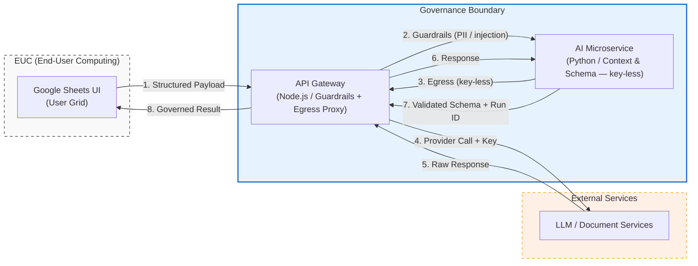

# EUC Spreadsheet Uplift

> **EUC governance by design: AI output governed like risk data.**

A proof-of-concept demonstrating how to bring immediate governance to end-user computing (EUC) spreadsheets without disrupting workflows. This repository contains a curated slice of the codebase (Google Sheets UI → API Gateway → AI / Document Services).

---

## Motivation & Approach

Enterprise **EUC spreadsheets** often handle critical operations but lack version control, lineage, and attribution. Forcing immediate migration to centralized IT systems disrupts workflows.

This architecture explores **control at the point of materiality**. By moving the risk surface (PII, AI egress, provenance) behind a governed gateway, we achieve immediate, progressive governance without sacrificing the familiar user interface. It acts as a transitional bridge, allowing eventual EUC remediation once the backend fully supports Business As Usual (BAU).

### Before vs. After

| Feature | ❌ Ungoverned EUC | ✅ Governed Architecture |
| :--- | :--- | :--- |
| **User Experience** | Complex logic relies on local macros or scripts. | Users stay in their familiar Google Sheets grid. |
| **Data Privacy** | Potential exposure of sensitive PII to external services. | **API Gateway** intercepts and redacts PII before egress. |
| **Schema & Contracts**| Unstructured inputs cause brittleness when formats change. | **Strict YAML contracts** enforce data schema at the boundary. |
| **Audit & Lineage** | Limited traceability and provenance. | **Append-only records** with `request_id → run_id` tracking. |

---

## System Architecture

--8<-- [start:arch_diagram]

--8<-- [end:arch_diagram]

📖 [Details](docs/index.md)

---

## What this repo demonstrates

An AI output is just another data element with poor lineage by default. It's held to the same three questions a bank asks of any critical data element:

1. **Data Schema**: Key boundaries are typed, versioned contracts with a single source of truth.
2. **Data Lineage & Provenance**: Tracking via `request_id → run_id → attempt` on material outputs.
3. **Data Governance & Controls**: PII egress control, guardrails, error-key governance.

📖 **Deep Dive:** For a detailed map of the spec files, schemas, and how they are consumed across the codebase, see the **[Consumption map in `specs/README.md`](specs/README.md)**.

---

## Security

Curated snapshot designed to exclude credentials, real PII, and production data (sample values in the spec CSVs are synthetic). Secrets are handled via environment / secret-manager and omitted from version control; a TruffleHog ruleset ([`.trufflehog/rules.yaml`](.trufflehog/rules.yaml)) guards for key patterns. Scanned with gitleaks & TruffleHog before publishing: see [`SECURITY.md`](SECURITY.md).

---

**Contact:** ws.chong.sg@gmail.com
