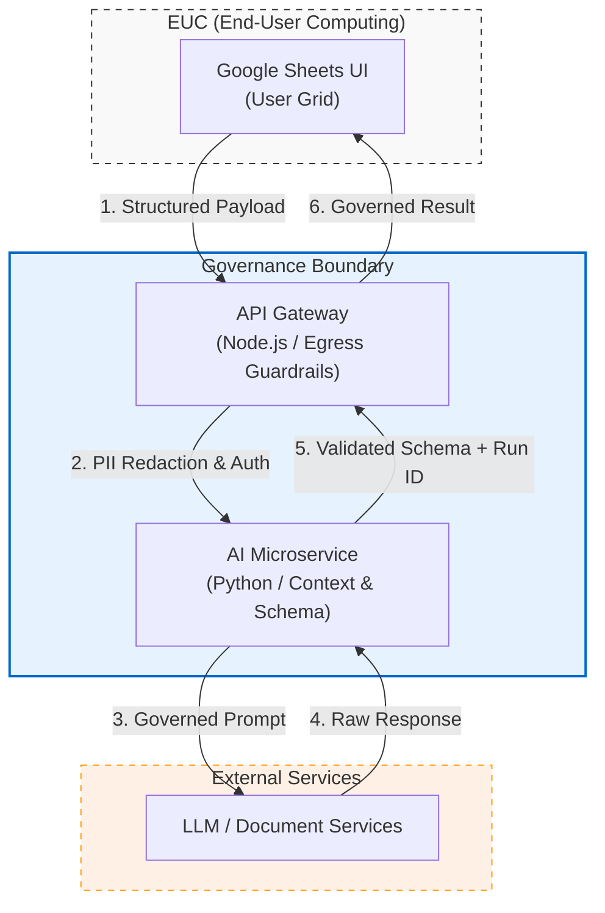

# EUC Spreadsheet Uplift

> **Governed AI output for end-user computing: schema · lineage · controls.**
> **EUC governance by design: AI output governed like risk data.**
> A proof-of-concept: keep users in the spreadsheet grid they won't give up, but move
> the risk surface (PII egress, provenance, system-of-record) behind a governed gateway.
> A curated, secret-free slice of the codebase (Google Sheets UI → API gateway → AI /
> document services). This repo is a guided tour of the **data-governance** design.

📖 **[Guided tour](docs/index.md)**: a readable walk-through of the schema · lineage · governance design.

📌 **Release:** [v1.0.1](https://github.com/VincentChong123/euc-spreadsheet-uplift/releases/tag/v1.0.1)

---

## System Architecture

## Why this matters (Before vs. After)

| Feature | ❌ Status Quo (Shadow IT) | ✅ This Architecture (Governed) |
| :--- | :--- | :--- |
| **User Experience** | Users build fragile, undocumented macros. | Users stay in their familiar Google Sheets grid. |
| **Data Privacy (PII)** | High risk of PII leaking directly to public LLMs. | **API Gateway** intercepts and redacts PII before egress. |
| **Schema & Contracts** | Unstructured inputs; everything breaks when formats change. | **Strict YAML contracts** enforce data schema at the boundary. |
| **Audit & Lineage** | No provenance. "The AI said so." | **Append-only records** with `request_id → run_id` tracking. |

---

## The EUC problem this addresses

One of the most under-governed off-book layers in a bank is **End-User Computing (EUC)**:
spreadsheets doing critical work with no version control, no lineage, no attribution.
The blunt fix (ban spreadsheets, force everything into slow IT) fails: users revolt and
build shadow IT, which *increases* risk.

This project takes the other path of **control at the point of materiality**:
- Users stay in the **familiar Google Sheet grid**.
- The material risk surface (data leaving to an LLM, PII, provenance, system-of-record)
  moves **behind a governed gateway**.
- Outputs become **append-only, attributed records** outside the EUC.

That is EUC control-pattern uplift aligned to how a bank governs critical data, not spreadsheet removal.

---

## What this repo demonstrates

An AI output is just another data element with poor lineage by default. It's held to the
same three questions a bank asks of any critical data element:

1. **Data Schema**: key boundaries are typed, versioned contracts with a single source of truth.
2. **Data Lineage & Provenance**: `request_id → run_id → attempt` on material outputs.
3. **Data Governance & Controls**: PII egress control, guardrails, error-key governance.

### 1 · Data Schema (contract-first)
| File | What it shows |
|---|---|
| [`specs/google-sheets-api-gateway-contract.yaml`](specs/google-sheets-api-gateway-contract.yaml) | The **schema contract** between the EUC (Sheet) and the gateway: the boundary is a defined interface. |
| [`specs/ba_business_schema.csv`](specs/ba_business_schema.csv) | Business schema with **versioned evolution (v1→v2→v3)** and per-field constraints. |
| [`specs/prompt-records-schema.yaml`](specs/prompt-records-schema.yaml) | Schema for AI prompt records: structured, auditable. |
| [`apps/ai_service/app/models/schemas.py`](apps/ai_service/app/models/schemas.py) | Schema **enforced in code** (typed validation at runtime). |
| [`apps/google-sheets-ui/sync_spec_yaml_note_schema.py`](apps/google-sheets-ui/sync_spec_yaml_note_schema.py) | Schema kept **in sync from a single source of truth**: no drift. |

### 2 · Data Lineage & Provenance
| File | What it shows |
|---|---|
| [`apps/ai_service/app/request_context.py`](apps/ai_service/app/request_context.py) | The **`request_id → run_id → attempt`** provenance chain: material outputs traceable through the run chain. |
| [`specs/prompt-records-schema.yaml`](specs/prompt-records-schema.yaml) | **Append-only** audit trail of AI interactions: reconstructable after the fact. |
| [`specs/program-sequence.md`](specs/program-sequence.md) | End-to-end flow / lineage of a request across services. |

### 3 · Data Governance & Controls
| File | What it shows |
|---|---|
| [`specs/ba_pii_rules_spec.csv`](specs/ba_pii_rules_spec.csv) | **Target** PII classification → action mapping (design intent: tokenize / partial-mask / hard-stop). The **implemented** gateway control is uniform first-line regex redaction: see `egressPiiGuardrail.mjs`; the tiered actions are not yet built. |
| [`apps/api_gateway/middleware/egressPiiGuardrail.mjs`](apps/api_gateway/middleware/egressPiiGuardrail.mjs) | **PII egress control** (regex, structured identifiers): governs data *leaving the EUC* to the LLM (the material risk surface). First-line control: it **redacts** matches (does not block/tokenize) and **fails open on a parse error**; free-text PII would need DLP/NER. |
| [`specs/guardrail.yaml`](specs/guardrail.yaml) · [`apps/ai_service/app/guardrails.py`](apps/ai_service/app/guardrails.py) | Guardrail definitions + enforcement. |
| [`apps/google-sheets-ui/plugin_hitl_ai.js`](apps/google-sheets-ui/plugin_hitl_ai.js) | Prompt authored in the cell note → LLM call → result and audit record written back to the sheet. |
| [`specs/error_codes.yaml`](specs/error_codes.yaml) · [`specs/validate_error_codes.py`](specs/validate_error_codes.py) | Error-**key** governance (`__ERROR_*__`), validated: never a raw status number. |

---

## Security
Curated snapshot with **no credentials, no real PII, and no production data** (sample
values in the spec CSVs are synthetic). Secrets are handled via environment /
secret-manager and never committed; a TruffleHog ruleset
([`.trufflehog/rules.yaml`](.trufflehog/rules.yaml)) guards for key patterns. Verified
with gitleaks & TruffleHog before publishing: see [`SECURITY.md`](SECURITY.md).

---

**Contact:** ws.chong.sg@gmail.com
