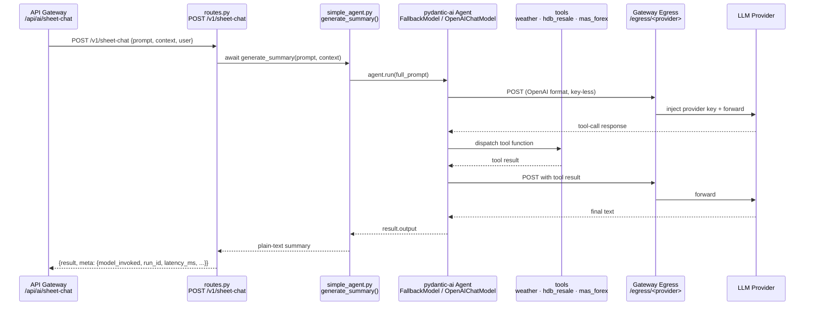

# 02 · AI Service

**Path:** `apps/ai_service` · **Stack:** Python 3.14 / FastAPI / uvicorn / pydantic-ai / uv

Business-logic service for LLM generation with real-time tool access.
**Key-less by design** — it never holds a provider key; it speaks OpenAI format
to the gateway egress (outbound) route, which injects the real key.

## Request flow



## Component responsibilities

| Layer | File | LLM aware | Tool aware |
|---|---|---|---|
| Entrypoint | `main.py` | No | No |
| Route handler | `app/api/routes.py` | No | No |
| Agent | `app/agents/simple_agent.py` | Yes | Yes — calls `register_all(agent)` |
| Tool registry | `app/agents/tools/__init__.py` | No | Yes — wires all tools; edit here only |
| Tools | `tools/*.py` | No | — |

**Tool invocation path.** Tools are not called by Python application code. At module load, `simple_agent.py` calls `register_all(agent)` (line 77), which delegates to `tools/__init__.py` to attach each tool to the pydantic-ai `Agent`. At inference time, `agent.run()` sends the prompt to the LLM; the model emits a tool-call response; pydantic-ai dispatches the matching registered function and feeds the result back to the model.

**Adding a new tool.** Create `tools/<name>.py` with a `register(agent)` function, then add one call in `tools/__init__.py → register_all()`. `simple_agent.py` and `routes.py` require no changes.

## Key files

| File | Role |
|---|---|
| `main.py` | FastAPI app, dynamic route prefix, Logfire instrumentation |
| `app/config.py` | Settings + **`resolve_llm()`** + `OPENROUTER_FALLBACK_MODELS` — single source of truth for provider/model/base_url. Reads repo-root `.env` via absolute path. |
| `app/api/routes.py` | `/sheet-chat` endpoint, response envelope + `model_invoked` |
| `app/agents/simple_agent.py` | pydantic-ai agent + `FallbackModel` chain; `register_all()` wires tools; `generate_summary()` |
| `app/agents/tools/__init__.py` | Tool registry — `register_all(agent)`. Add new tools here only; `simple_agent.py` never changes for new tools. |
| `app/agents/tools/datetime_now.py` | Current date/time (`fetch_current_datetime`). Local, no network, no key. Resolves prompt-named cities/IANA zones; default via `settings.default_timezone`. |
| `app/agents/tools/weather.py` | NEA 2-hour forecast (`fetch_weather`). No key. |
| `app/agents/tools/hdb_resale.py` | data.gov.sg HDB resale prices (`fetch_hdb_resale_prices`). No key. |
| `app/agents/tools/mas_forex.py` | MAS SGD exchange rates (`fetch_mas_forex_rates`). Requires `MAS_FOREX_EOD_API_KEY`; skipped if unset. |
| `system_instruction.md` | LLM system prompt — instructs model when to call each tool. |
| `app/models/schemas.py` | Request/response pydantic models |
| `app/errors.py` | Error registry — validated against `specs/error_codes.yaml` (see [../03_Reference/error_code_spec.md](../03_Reference/error_code_spec.md)) |
| `app/guardrails.py` | Output **quality** checks only: refusal detection + length cap. PII enforcement is centralised at the gateway — this file does not scan for PII. |
| `utils/secret_manager.py` | GCP Secret Manager helper (unused at runtime now) |
| `tests/` | Mocked CI-safe suite + opt-in live integration (`RUN_INTEGRATION=1`) |

## Provider selection and model fallback

`config.py` resolves `LLM_PROVIDER` → egress mount + default model + base URL via
`_PROVIDER_DEFAULTS`. Switching providers is an **env change only** — no code edit.

- `LLM_PROVIDER` — `openrouter` (primary) | `groq` | `vertex`
- `LLM_GATEWAY_URL` — gateway base (docker: `http://api-gateway:3000`)
- `LLM_MODEL` — optional single-model override; **if unset on openrouter**, the agent uses a `FallbackModel` chain

### OpenRouter FallbackModel chain

When `LLM_PROVIDER=openrouter` and `LLM_MODEL` is not set, `simple_agent.py`
builds a `FallbackModel` that rotates through models in order on HTTP error (429, 5xx):

```
google/gemma-4-31b-it:free  →  qwen/qwen3-coder-480b-a35b:free  →  openai/gpt-oss-20b:free
```

All three support OpenAI function-calling and are free on OpenRouter.
The chain is defined in `config.py · OPENROUTER_FALLBACK_MODELS` — edit there to change order or add models.

### Groq (alternative, faster tool-use)

`LLM_PROVIDER=groq` uses `llama3-groq-70b-8192-tool-use-preview` by default —
a model fine-tuned for function calling. No fallback chain; single model.

### Tool argument schema rules

- Use `str` not `list[str]` for multi-value args — pass as `"USD,EUR"`, split inside the function.
  Some models serialise list args as JSON strings; primitive types are universally reliable.
- MAS forex `currencies` accepts `Union[list[str], str]` with coercion for backward compatibility.

See [05-egress-llm.md](05-egress-llm.md).

## Testing

```bash
uv run pytest tests/test_routes.py -q          # mocked, CI-safe — routes + envelope
uv run pytest tests/test_tools.py -q           # mocked, CI-safe — tool fetch functions
RUN_INTEGRATION=1 uv run pytest tests/test_tools.py -q          # live API calls (NEA, HDB, MAS)
RUN_INTEGRATION=1 uv run pytest tests/test_integration.py -q    # live end-to-end (needs gateway)
```

Tool tests mock `httpx.AsyncClient` — no network, no keys required for unit runs.
Live tool tests hit real public APIs; MAS forex additionally requires `MAS_FOREX_EOD_API_KEY` in env.

## Run

```bash
cd apps/ai_service && uv run uvicorn main:app --host 0.0.0.0 --port 8080
```
