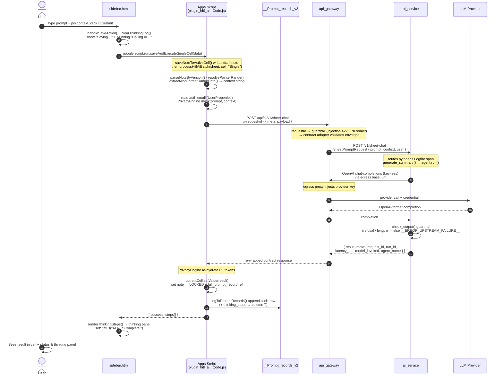
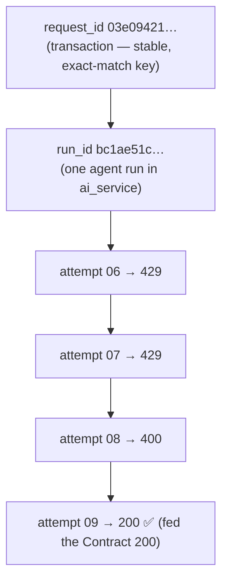
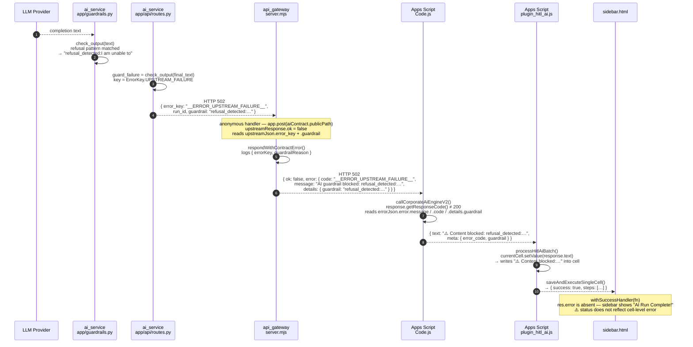

# 09 · End-to-End Sequence — Prompt to Visible Response

Full lifecycle of one delegation: **user types a prompt in the sidebar → result
appears in the cell**. Traces the *currently implemented* synchronous path and
names the exact functions at each step.

> Companion to the block diagram in
> [08-component-interfaces.md](08-component-interfaces.md).

---

## Sequence diagram

---

## Step narrative (grouped by phase)

**1 · Capture (client)**
User enters prompt + pins context ranges, clicks Submit. `handleSaveAction()`
resets the thinking panel and shows immediate optimistic status.

**2 · Resolve + protect (Apps Script)**
`processHitlAiBatch` parses the cell note, resolves pointer/named ranges into
concrete data (`extractAndFormatRangeData`), reads the authenticated email from
`UserProperties`, and **masks PII locally** (`PrivacyEngine.mask`) before
anything leaves Google.

**3 · Ingress (inbound) + guardrails (gateway)**
`callCorporateAiEngineV2` POSTs the `{ meta, payload }` envelope with
`x-request-id`. The gateway assigns/propagates the request id, runs input
guardrails (injection → 422, PII → redact), validates the contract, and forwards.

**4 · Generate (ai_service, key-less)**
`routes.py` wraps the run in a Logfire span; `generate_summary` calls the
pydantic-ai agent, which speaks **OpenAI format back through the gateway egress**
(where the provider key is injected). Output guardrails (`check_output`) run
before returning.

**5 · Return + re-wrap (gateway)**
`ai_service` returns `{ result, meta }`; the gateway re-wraps it into the
contract response and hands it back to Apps Script.

**6 · Commit + audit (client)**
Apps Script **re-hydrates** the masked PII, writes the result into the cell,
locks the note with a `full_prompt_record` reference, and appends the audit row
to `__Prompt_records_v2` (including `thinking_steps` in column T). The `steps[]`
are returned to the sidebar, which renders them in the thinking panel.

---

## Traceability thread

A single **`x-request-id`** ties the whole chain: assigned/echoed at the gateway,
forwarded to `ai_service`, returned in `meta`, and persisted in the audit row —
so any delegation is reconstructable end-to-end
([07-security-auditability.md](07-security-auditability.md) §3).

### Three-tier correlation hierarchy

The system carries **three nested identifiers**, each with a distinct scope and
lifetime. They are *not* interchangeable — keeping them separate is what lets a
single `grep request_id=<uuid>` reconstruct the whole transaction while still
telling apart individual agent runs and physical LLM attempts.

| Id | Scope | Born | Stable across… | Answers |
|----|-------|------|----------------|---------|
| **`request_id`** | the whole transaction (Sheet → gateway → ai_service → *all* egress attempts) | Sheets UI / gateway `requestId.mjs` | every hop **and** every retry | "which Sheet submit is this?" |
| **`run_id`** | one agent execution inside `ai_service` | `routes.py` (`uuid4`) | one agent run | "which agent invocation produced this?" |
| **`attempt`** | one physical LLM egress POST | `ai_service` per-request counter | — (increments each call) | "which retry/fallback call is this?" |

Analogy to distributed tracing: `request_id` ≈ trace, `run_id` ≈ span,
`attempt` ≈ retry counter.

### End-to-end `request_id` propagation (including the egress hop)

`request_id` is **minted once and preserved, never regenerated**:

1. **Sheets UI → gateway** — the UI may send `x-request-id`; if absent the gateway
   mints a `uuid` (`middleware/requestId.mjs`). Either way `req.id` is now the id.
2. **Gateway → ai_service** — forwarded verbatim as the `x-request-id` header.
3. **ai_service** — read at `routes.py` and bound to the async request context
   (`app/request_context.py`, a `ContextVar`) so it survives into library code
   whose signatures we don't control (pydantic-ai → httpx).
4. **ai_service → gateway egress → LLM provider** — an httpx `event_hook`
   (`agents/simple_agent.py`) stamps the **same** `x-request-id` on *every*
   outbound LLM call, so the gateway's `requestId.mjs` **preserves** it instead of
   minting a fresh uuid. The hook also emits `x-request-attempt` (a 2-digit
   per-request counter) so each of the N retry/fallback calls is distinguishable
   while `request_id` stays a single stable value.

> **Why the `ContextVar`, not a function argument?** The pydantic-ai agent,
> provider and httpx client are module-level singletons shared by all concurrent
> requests, but the id is per-request. A `ContextVar` is async-task-local, so each
> in-flight Sheet submit sees its own `request_id` + `attempt` counter without
> threading them through every intermediate call. The value bound is *literally*
> the inbound `x-request-id` — so the whole chain stays a single source of truth.

> **Historical gap (fixed):** before this, `ai_service`'s egress calls carried no
> `x-request-id`, so the gateway minted a *fresh* uuid per LLM attempt — the egress
> logs could only be tied back to the originating request by timestamp/pid, which
> breaks under concurrency. The propagation above closes that gap.

**Naming convention:** the id is spelled **`request_id`** (snake_case) everywhere
it is a wire/contract field or a log-field key — across both the Node gateway and
the Python service — so one query string matches every hop. The Express property
`req.id` and the middleware *function* `requestId` keep their JS-idiomatic names
(they are the mechanism, not the value). Same treatment applies to `run_id`.

## What this diagram deliberately omits

- The **future SSE/agentic path** (live `thinking` events, OIDC-verified ingress)
  — augments, not replaces, this sync flow; see
  [08-component-interfaces.md](08-component-interfaces.md).

---

## Error propagation path

Any hop may short-circuit with an `error_key`. The diagram below traces the
**filename → function → payload** at each boundary for the guardrail-blocked
case (`__ERROR_UPSTREAM_FAILURE__` + `guardrail` reason). Other error origins
(timeout, invalid JSON, injection block) follow the same gateway→Sheets leg.

### Error payload at each boundary

| Boundary | File · Function | Key fields |
|---|---|---|
| ai_service internal | `guardrails.py · check_output()` | returns `"refusal_detected:<matched>"` string |
| ai_service → gateway | `routes.py · post_sheet_chat()` | `{ error_key, run_id, guardrail }` · HTTP 502 |
| gateway internal | `server.mjs · respondWithContractError()` | logs `errorKey`, `guardrailReason` |
| gateway → Apps Script | `server.mjs · app.post(aiContract.publicPath)` | `{ ok, error: { code, message, details.guardrail } }` · HTTP 502 |
| Apps Script parse | `Code.js · callCorporateAiEngineV2()` | `{ text: "⚠️ Content blocked:…", meta.error_code, meta.guardrail }` |
| Apps Script → cell | `plugin_hitl_ai.js · processHitlAiBatch()` | `currentCell.setValue(response.text)` |
| Apps Script → sidebar | `sidebar_backend.js · saveAndExecuteSingleCell()` | `{ success: true, steps }` — error not surfaced to sidebar status |

### Known gap

`sidebar.html · withSuccessHandler()` always receives `{ success: true }` from
`saveAndExecuteSingleCell` — the sidebar status reads **"AI Run Complete!"** even
when the cell contains an error string. To fix: `processHitlAiBatch` should
detect `response.meta.error_code` and propagate it in the return value so the
sidebar can show the correct status.

See [`../03_Reference/error_code_spec.md`](../03_Reference/error_code_spec.md)
for the full `error_key` registry.
