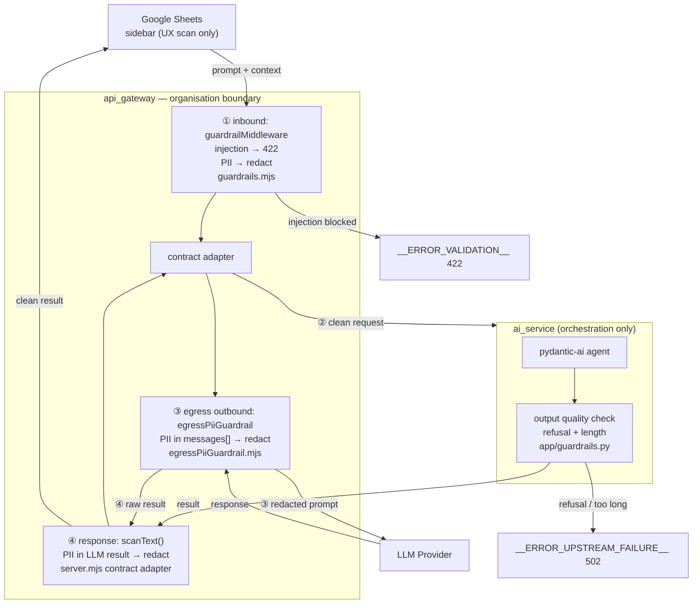

# 07 · Security, Guardrails, Traceability & Auditability (cross-cutting)

How this system stays defensible for a **financial** context: what protects it,
what constrains the AI, and how every action can be reconstructed after the fact.

This page separates **what is in place today** from **known gaps** so nobody
mistakes an aspiration for a control.

---

## 1. Security

> Terminology: **ingress** = *inbound* (calls coming into our system);
> **egress** = *outbound* (calls our system makes to external services).

### Trust boundaries

```
User ──(Google ACL)──▶ Sheet ──(HTTPS)──▶ api_gateway ──▶ ai_service / document_service
                                              │
                                              └──(provider key / OAuth)──▶ LLM provider
```

- **Sheet ACL** controls *who can open the spreadsheet*. It does **not**
  authenticate calls to the gateway URL — see Gaps.
- **api_gateway** is the only component exposed publicly and the only one holding
  provider credentials.
- Backend services (`ai_service`, `document_service`) are **key-less** and should
  only be reachable inside the private network / Cloud Run internal ingress.

### Secret encapsulation (in place)

- LLM provider keys live **only** in the gateway env — dev via docker `env_file`,
  prod via Cloud Run secret→env, Vertex via the service account (no stored key).
- Downstream services speak plain OpenAI format to `/egress/<provider>` and never
  see a credential — see [05-egress-llm.md](../01_Architecture/05-egress-llm.md).
- `.env` is gitignored; loggers **redact** `authorization`, `*key*`, `*secret*`,
  `*password*`. Never log a secret value; reference by prefix/length only.
- Any credential that appears in a log, transcript, or shared channel must be
  **rotated**.

### Transport & surface hardening (in place)

- Upstream timeouts bound every hop (`UPSTREAM_TIMEOUT_MS`, `LLM_EGRESS_TIMEOUT_MS`).
- Request body size capped (`JSON_BODY_LIMIT`, default 1mb) to blunt payload abuse.
- Port guard + graceful shutdown prevent half-started / shadowed instances.

### Known gaps (deliberately deferred — track before prod)

- **No ingress authentication.** The gateway URL is not protected by the Sheet ACL.
  This is the **top remaining production risk**. Candidates: signed Apps Script
  identity token, a shared gateway secret header, or Google IAP / Cloud Run IAM.
- **No rate limiting.** `__ERROR_RATE_LIMIT__` is reserved in the registry but no
  limiter is wired (needs e.g. `express-rate-limit`).
- **No per-user authorization** — the system cannot yet attribute a request to a
  named principal (blocks true per-user audit; see §3).

---

## 2. Guardrails (AI safety & control)

Guardrails constrain *what the AI is allowed to do and produce* — distinct from
security, which constrains *who can reach the system*.

### In place

- **No autonomous side effects from the model.** The LLM returns content; writing
  back to the sheet and generating PDFs are performed by application code, not by
  the model acting unattended.
- **Human-in-the-loop:** the sidebar's "Locked / Run AI when saved" flags let a
  user gate execution and review output before it is committed.
- **Bounded model access:** services reach LLMs only through the gateway egress —
  no direct outbound calls, no arbitrary endpoints.
- **No automatic provider failover** — a deliberate low-surprise choice; the
  active provider is an explicit `LLM_PROVIDER` env flip.
- **Structured contract envelope** (`meta` + `payload`) is validated at the
  gateway, so malformed or oversized delegations are rejected before reaching the
  model.

### MVP guardrail architecture (implemented)

**Design principle:** the gateway is the organisation boundary — all PII enforcement is
centralised there. The sidebar's client-side scan is a UX convenience (early warning),
not the security control. PII cannot bypass the gateway regardless of client behaviour.

Rules are parameterized in **`specs/guardrail.yaml`** — add or tune patterns without
touching code. The gateway loads and compiles them once at startup.



#### Four enforced crossings (all at gateway)

| # | Crossing | Where | What |
|---|---|---|---|
| ① | Sheets → gateway (inbound) | `middleware/guardrails.mjs` | injection → 422 reject; PII → redact + log |
| ② | Gateway → ai_service | same middleware (same request body) | PII already redacted by ① |
| ③ | Gateway egress → LLM (outbound) | `middleware/egressPiiGuardrail.mjs` | scans `messages[].content`; redacts before prompt leaves org |
| ④ | LLM → gateway → Sheets (return) | `server.mjs` contract adapter via `scanText()` | scans `result` from ai_service; redacts before Sheets sees it. Runs only rules where `output ≠ false` — see *Redaction policy* below |

**To add a new PII pattern** — append to `pii_patterns` in `specs/guardrail.yaml`
and restart the gateway. All four crossings update automatically. No code change required.

#### Redaction policy — crossings are asymmetric

The four crossings do **not** run the same rule set. Direction matters:

- **Inbound / outbound-to-LLM (① ② ③)** carry *user-supplied* content (prompt +
  context). Scan the **full** rule set, each rule scoped by its `fields`.
- **Return (④, `scanText`)** carries the *model's generated answer* — which for
  this assistant is mostly financial data (rates, dates, amounts). It runs
  **only** rules where `output` is not `false`.

**Why the asymmetry is safe:** PII is redacted inbound *before the model ever
sees it*, so the model cannot echo back what it never received. Re-scanning
ambiguous numeric patterns on the return path therefore adds negligible
protection while corrupting legitimate answers — e.g. an exchange rate `1.2905`
matched as a phone number, or `USD SGD` matched as an all-caps name. The `output`
flag lets a rule opt out of crossing ④ only.

| Rule | On return path (④)? | Reason |
|---|---|---|
| `sg_nric`, `sg_passport`, `payment_card`, `email` | **yes** | Hard identifiers — defense-in-depth if the model ever surfaces one |
| `phone_number` | **yes** (after tightening) | Now requires SG 8/9-prefix or a leading `+`; no longer matches rates/dates |
| `sg_postal_code`, `sg_bank_account`, `full_name_allcaps` | **no** (`output: false`) | Over-match plain numbers / currency-code pairs in answers |

#### Dates are not redacted (risk-based decision)

The `date_of_birth` rule was **removed**. Rationale, in data-protection terms:

- A standalone date is a **quasi-identifier**, not an identifier. Under PDPA /
  GDPR it identifies no one on its own — only in combination with a name/NRIC and
  a linking dataset (the classic DOB + gender + postal-code re-identification
  requires all three plus external data).
- The **identifying half is already redacted** by `sg_nric` and
  `full_name_allcaps`. Once the name is gone, an adjacent date is orphaned.
- Regex sees *form*, not *meaning*: `15/03/1990` (a birthday) and `2024-11-29`
  (a transaction date the assistant must reason about) are indistinguishable by
  token. Redacting all dates broke every legitimate date query for near-zero
  privacy gain. MAS Notice 655 restricts the **NRIC** specifically; DOB carries
  no comparable restriction.
- **Intent analysis is the wrong tool.** Classifying "is this a birthday?" with
  an LLM would require sending the raw date to a model to decide whether to
  protect it — protection *after* the boundary crossing, plus latency, cost, and
  an unauditable guardrail. Disambiguation here is a *context* problem, not an
  *intent* problem.

**If a DPO assessment later requires date redaction**, prefer a deterministic
variant over intent analysis:
- **Cue-gated** — redact a date only when a birth-context keyword (`DOB`, `born`,
  `date of birth`, `birthday`) sits within a short window of it.
- **Linkage-aware** — redact a date only when the same payload also trips a
  name/NRIC rule (i.e. the date is actually bound to an identity).

#### ai_service responsibility (output quality only)

`app/guardrails.py` handles output *quality* signals the gateway cannot assess:

| Check | Action |
|---|---|
| **Refusal detection** — model says `"I am unable to"`, `"As an AI"`, etc. | `__ERROR_UPSTREAM_FAILURE__` (502) — do not write to Sheet |
| **Output length cap** | `__ERROR_UPSTREAM_FAILURE__` (502) |

PII is no longer checked here — that is crossing ④ at the gateway.

#### Sidebar client-side scan (UX layer, not enforcement)

The sidebar fetches patterns from `GET /guardrail/patterns` on load and scans the
prompt before submit. If PII is detected, the user sees a warning and can choose
auto-redact or manual edit. This is a friction-reducer, not a security control —
the gateway enforces regardless of what the sidebar does.

#### HITL — keep for MVP

The sidebar's "Locked / Run AI when saved" flag is the catch-all for any output
the automated layers do not catch. Do not remove or bypass.

### Deferred post-MVP

| Deferred | Why safe to defer |
|---|---|
| Microsoft Presidio / Cloud DLP | Regex covers structural PII. Semantic PII (names in free text) low-risk while HITL is active |
| Numeric range sanity check | Requires known expected ranges per prompt type — needs product definition |
| Deny-list / topic filter | Low risk while system instruction scopes the domain |
| Per-user rate limiting | Add together with ingress auth (§1) |

#### HITL as an agentic guardrail

For **agentic AI** (where the model can trigger real actions — approvals, filings,
data writes), the HITL pattern is itself the primary guardrail:

```
LLM output → human reviews → approves → action executes
                           → rejects → logged, no effect
```

The sidebar's "Locked / Run AI when saved" flag already implements this for the
current generation. As agency grows (tool-calling, multi-step), the HITL gate
must be **explicitly preserved** — agentic loops that bypass human review are the
highest-risk failure mode in finance AI.

| Agentic risk | Guardrail |
|---|---|
| Agent takes an irreversible action (file, trade, send) | Require explicit human approve step before irreversible ops |
| Agent calls an unintended tool | Tool-use allowlist: explicit reviewed set, per-tool argument validation |
| Agent loops / escalates cost silently | Max-steps budget + cost cap enforced at gateway egress |
| Prompt injection via retrieved context | Separate system prompt from retrieved content; never interpolate raw cell data into the system role |

#### Other recommended controls

- **Step-up MFA (TOTP / Google Authenticator):** free second factor on high-risk
  actions (approve/release), on top of the JWT identity — design in
  [specs/totp_mfa_spec.md](../specs/backlog/auth/totp_mfa_spec.md).
- **Data-residency / no-training:** for prod, use provider tiers that exclude
  prompts from training (avoid `:free` OpenRouter routes for bank data) — prefer
  the Vertex enterprise path. See [05-egress-llm.md](../01_Architecture/05-egress-llm.md).

---

## 3. Traceability

Every request should be reconstructable end-to-end from a single correlation id.

- **`X-Request-ID`** is assigned at the gateway (or preserved if the client sends
  one), returned to the client, and **forwarded to every upstream — including the
  LLM egress hop**. `ai_service` re-stamps it on every outbound provider call
  (`app/request_context.py` + `agents/simple_agent.py`) so the gateway *preserves*
  the id rather than minting a fresh one per retry. Always propagate it; always
  log it. (`middleware/requestId.mjs`.)
- **Nested correlation ids** — three tiers, kept separate on purpose (full table +
  propagation walkthrough in [09-end-to-end-sequence.md](../01_Architecture/09-end-to-end-sequence.md)
  §"Traceability thread"):
  - `request_id` — the whole transaction; stable across every hop **and** retry.
  - `run_id` — one agent run inside `ai_service` (returned in `meta`).
  - `attempt` — a 2-digit per-request counter on each physical LLM egress POST,
    logged as `x-request-attempt`, so retries/fallbacks are distinguishable while
    `request_id` stays a single exact-match key.
- **Structured JSON logs** on every hop (pino / Logfire+logging) — one line per
  event, machine-parseable, secrets redacted.
- **Egress latency + provider** are logged on the way out (`[Egress] ->`) and back
  (`[Egress] <-`) with `request_id` + `attempt`, so each LLM call — including the
  429/fallback retries — is tied to its request and timed.
- **`model_invoked`** (`<provider>:<model>`) is returned in the AI response `meta`,
  recording *which* provider/model produced a given result.
- **Errors carry a precise `error_key`** in the body even when the HTTP status is
  one-to-many — see [../03_Reference/error_code_spec.md](../03_Reference/error_code_spec.md).

Practical rule: given a `request_id`, you can grep gateway + service logs and
recover the full path (ingress → service → egress → provider) — every retry
included, ordered by `attempt` — and the outcome.

---

## 4. Auditability

Auditability = a durable, reviewable record of *who asked for what, what the AI
did, and what was committed* — the standard a bank's controls/records team expects.

### In place

- **Full-prompt records + `request_id`** are stored by the Sheets UI for
  traceability (see [04-google-sheets-ui.md](../01_Architecture/04-google-sheets-ui.md)).
- **Audit memo** field in the sidebar lets the user attach a business
  justification to a delegation.
- **Human-in-the-loop flags** create a review checkpoint before commit.
- `model_invoked` + `request_id` link a written-back result to the exact model run.

### Known gaps (needed for a bank-grade audit trail)

- **No authenticated principal.** Without ingress auth (§1) actions cannot be
  attributed to a named user — the single biggest audit gap.
- **No tamper-evident, append-only audit log.** Logs today are operational
  (JSON to stdout), not a retained, immutable record. A finance deployment
  typically needs a durable store (append-only bucket / WORM / signed entries)
  with a defined retention period.
- **No change/version trail** for prompts and model/config versions tied to each
  decision.

### Recommended audit record (one entry per delegation)

`request_id` · timestamp · **authenticated user** · sheet + range · prompt hash ·
audit memo · `model_invoked` · outcome (`error_key` or success) · human-review flag.

---

## 5. Priority order (if hardening for production)

1. **Ingress authentication** — unblocks attribution, which unblocks real audit.
2. ✅ **Input guardrails** — injection rejection + PII redaction at gateway ingress (`middleware/guardrails.mjs`); rules in `specs/guardrail.yaml`.
3. ✅ **Output guardrails** — refusal detection + length cap at ai_service (`app/guardrails.py`); rules in `specs/guardrail.yaml`.
4. **Durable, append-only audit log** — HMAC-signed JSONL → MinIO (dev) / GCS
   Object Lock (prod); Sheet `__Prompt_records_v2` is the human-readable mirror,
   not the system of record.
5. **Rate limiting** (`__ERROR_RATE_LIMIT__`).
6. **No-training / data-residency** provider tier for prod traffic.

> Guardrails (2, 3) determine whether you are **allowed to go live**;
> the audit log (4) determines whether you are **allowed to stay live**.
> For agentic systems taking real actions, guardrails are the existential gate.

> These are cross-cutting; when you implement one, update this page **and** the
> affected component page (e.g. [01-api-gateway.md](../01_Architecture/01-api-gateway.md)).

---

## 6. Data classification

> **Status: stub — fill before compliance review.**

Define which data fields are PII / confidential / public so every team member
knows what controls apply at each boundary.

| Classification | Examples in this system | Controls required |
|---|---|---|
| **Public** | System error codes, model name | None |
| **Internal** | `request_id`, latency, `model_invoked` | Log, retain normally |
| **Confidential** | Prompt text, sheet cell content, audit memo | Redact from external logs; no-training provider tier in prod |
| **Restricted / PII** | Names, NRICs, account numbers, card numbers (if present in cells) | Must not leave trust boundary to external LLM without DLP screening; durable encrypted retention |

**Action items:**
- Confirm with the data owner which sheet ranges may contain PII.
- Wire PII/PCI screening (Presidio or Cloud DLP) at gateway egress before any
  restricted data can reach an external LLM provider (see §2 guardrails).
- Define retention period and deletion schedule for audit records containing
  confidential data.

---

## 7. Third-party / vendor risk

> **Status: stub — complete before onboarding to a regulated environment.**

Every external dependency that touches customer data or processes prompts is a
sub-processor and requires a vendor risk assessment.

| Vendor | Role | Concern | Mitigation path |
|---|---|---|---|
| **OpenRouter** | LLM proxy (default `LLM_PROVIDER`) | Free-tier routes used for training; data residency unclear | Switch to enterprise/no-training routes; obtain DPA |
| **Groq** | LLM provider alternative | Similar data-use terms | Same as OpenRouter; confirm no-training opt-out |
| **Google Vertex AI** | LLM provider (enterprise path) | GCP data residency, enterprise SLA | Preferred for prod; service-account auth already designed |
| **Google Cloud Run** | Compute / hosting | Data residency, SLA | GCP region selection; enterprise support tier |
| **Logfire / Pydantic** | Observability / tracing | Prompt snippets may appear in traces | Configure to redact; or run self-hosted Logfire |

**Action items:**
- Obtain a Data Processing Agreement (DPA) from each vendor that processes
  prompt content.
- Confirm no-training opt-out is in effect before sending non-public data.
- Add Vertex as the mandatory `LLM_PROVIDER` for regulated workloads
  (see [05-egress-llm.md](../01_Architecture/05-egress-llm.md)).
- Review sub-processor list quarterly.

---

## 8. Incident response

> **Status: stub — define before go-live.**

What to do when something goes wrong.

### Severity tiers

| Tier | Example triggers | Target response |
|---|---|---|
| **P1 — Critical** | LLM returns harmful / incorrect financial output written to a customer record; credential leak | Immediate (< 1 h): disable gateway, rotate credential, notify DPO |
| **P2 — High** | Gateway unreachable; repeated upstream timeouts; guardrail bypass detected | Same business day |
| **P3 — Medium** | Elevated error rate; unexpected model switch | Within 48 h |

### Runbook (stub)

1. **Detect** — alert on sustained error rate or anomalous latency (Logfire / Cloud Run metrics).
2. **Contain** — disable the affected service (set `IS_AI_SERVICE_ACTIVE=false` / `IS_DOC_SERVICE_ACTIVE=false`); the gateway returns `__ERROR_SERVICE_UNAVAILABLE__` without crashing.
3. **Credential compromise** — rotate the affected key immediately; the impacted `LLM_PROVIDER` key is in Cloud Run secrets (prod) / `.env` (dev). Reference [05-egress-llm.md](../01_Architecture/05-egress-llm.md) for which env var to rotate.
4. **Assess** — pull `request_id` range from logs; reconstruct the affected requests using the audit trail (§4).
5. **Notify** — DPO and affected users if PII was involved; follow jurisdiction-specific breach notification timelines.
6. **Post-mortem** — update guardrails and this page with lessons learned.

---

## 9. Business continuity (BCP / DR)

> **Status: stub — define SLAs and test before go-live.**

| Metric | Target | Current status |
|---|---|---|
| **RTO** (recovery time objective) | TBD | Not formally defined |
| **RPO** (recovery point objective) | TBD | Not formally defined |
| **Availability target** | TBD | Not formally defined |

### Degraded-mode behaviour (in place)

- Per-service `IS_*_ACTIVE` flags let the gateway disable a backend without
  downtime — requests to a disabled service return `__ERROR_SERVICE_UNAVAILABLE__`
  immediately rather than timing out.
- Services are independently deployable (Cloud Run); one service going down does
  not restart others.

### Gaps

- **No multi-region / failover deployment.** Single Cloud Run region; a region
  outage takes down all services.
- **No LLM provider failover.** Provider switch requires a manual `LLM_PROVIDER`
  env change and redeploy (intentional — see §2 guardrails — but means no
  automatic continuity if the active provider is down).
- **No backup / restore procedure** for Sheet prompt records.

**Action items:**
- Define RTO/RPO with the business owner.
- Decide whether LLM provider failover is acceptable (trade-off: continuity vs.
  surprise model switch mid-workflow).
- Test the `IS_*_ACTIVE=false` degraded path in staging.

---

## 10. Model governance

> **Status: stub — required for regulated AI use.**

Controls ensuring that model and prompt changes are reviewed, tested, and
traceable before affecting users.

### In place

- `model_invoked` (`<provider>:<model>`) is returned in every AI response `meta`
  and logged — so each result is tied to the exact model that produced it.
- Provider and model are env-driven (`LLM_PROVIDER`, `LLM_MODEL`) — changes
  require a deployment, not a code push, providing a natural change gate.
- System instruction is externalized to `apps/ai_service/system_instruction.md` —
  prompt changes are visible in git history.

### Gaps / recommended controls

| Control | Status |
|---|---|
| Prompt change approval process (who reviews, who approves) | ❌ not defined |
| Model version pinning (avoid silent upstream updates from provider) | ❌ not enforced — provider may update a model alias |
| Regression test suite for prompt/model changes | ❌ only unit tests exist; no golden-output regression set |
| Rollback plan for a bad model/prompt change | ❌ not documented |
| Model card / risk assessment per model used | ❌ not documented |

**Action items:**
- Pin explicit model versions in `LLM_MODEL` (e.g. `gpt-4o-2024-08-06` not `gpt-4o`)
  so provider-side updates don't silently change behaviour.
- Define a lightweight change process: PR review of `system_instruction.md` →
  staging test → approval → deploy.
- Build a small golden-output test set (10–20 representative prompts with
  expected structure) and run it on every model/prompt change.

---

## 11. Access control matrix

> **Status: stub — define with the operations team.**

Who can do what across environments.

| Action | Dev | Staging | Prod |
|---|---|---|---|
| View logs | Developer | Developer | Ops / Compliance (read-only) |
| Change `.env` / env vars | Developer | Tech Lead | Change-board approved |
| Deploy a service | Developer | Tech Lead | Change-board approved |
| Rotate LLM provider key | Developer | Tech Lead | Security team |
| Approve a prompt / model change | Developer | Tech Lead + 1 reviewer | Tech Lead + Compliance sign-off |
| Access audit log store | Developer | Developer | Compliance / Audit team only |
| Disable a service (`IS_*_ACTIVE`) | Developer | Ops | Ops (P1 runbook) |

**Action items:**
- Assign named roles to the columns above.
- Enforce Cloud Run IAM so only the designated principal can deploy.
- Ensure audit log GCS bucket has a separate IAM principal from the application
  service account (least privilege).
