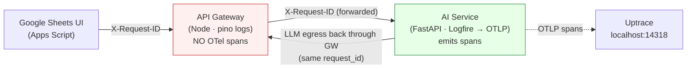
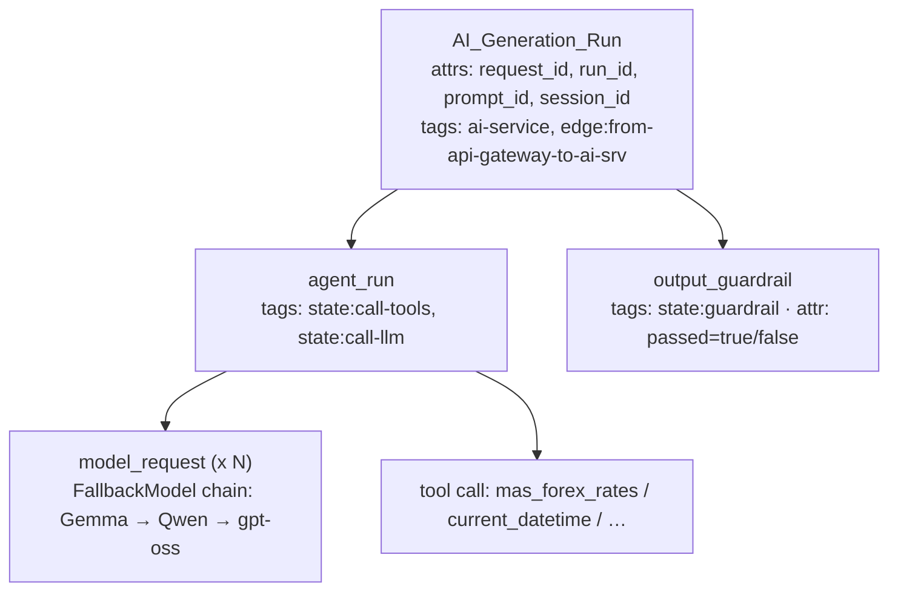

# End-to-End Tracing with Uptrace

How a single Google-Sheets request is traced across the stack, how the IDs line
up, and how to find a request in Uptrace. Read this when a request failed and you
need to see *where* — or when a trace "cannot be found".


---

## TL;DR

- **`request_id` is a UUID** (`93d0009d-268b-…`, with dashes). **An OTel `trace_id`
  is 32 hex chars, no dashes.** They are *different things*.
- In Uptrace, **filter by the `request_id` attribute** (facet panel / query bar).
  Do **not** paste a `request_id` into the trace-ID lookup — it will always say
  *"Trace not found"*.
- Only **`ai_service` emits OpenTelemetry spans**. The Node API gateway logs
  (pino) but emits no spans, so `request_id` / `run_id` are the only keys that
  correlate a gateway log line with an `ai_service` trace.

---

<!-- HARDENED ANCHOR: slug #traceability-coverage is linked from resume.draft.md (Operationalizing Data Lineage). Do NOT rename this header or the resume link 404s. -->
## Traceability Coverage



| Component | Telemetry | Where |
| --- | --- | --- |
| Google Sheets UI | none | — |
| **API Gateway** | pino **logs only** (JSON, `service: api-gateway`). **No OTel spans.** | `apps/api_gateway` |
| **AI Service** | **Logfire → OpenTelemetry spans** + Python logging | `apps/ai_service` |
| Uptrace | trace backend (ClickHouse + Postgres) | `infrastructure/logfire/` |

> The gateway does **not** inject a W3C `traceparent` header, so there is no
> distributed-trace linkage between the two services. The **`request_id`** (and
> `run_id`) is the join key — carried as the `X-Request-ID` header and recorded
> as a span attribute in `ai_service`.

---

## The identifiers

| ID | Shape | Minted by | Purpose |
| --- | --- | --- | --- |
| `request_id` | UUID `xxxxxxxx-xxxx-…` | Gateway — `middleware/requestId.mjs` (`req.headers['x-request-id'] \|\| randomUUID()`) | Correlates every gateway log line + the `ai_service` trace for one Sheets request. |
| `run_id` | UUID | `ai_service` — `routes.py` (`uuid.uuid4()`) | One AI generation run. Present in the response body even on failure. |
| `prompt_id` | UUID | `ai_service` — `routes.py` | The specific prompt within a run. |
| **OTel `trace_id`** | **32 hex, no dashes** | Logfire/OTel SDK inside `ai_service` | Uptrace's native trace key. **Unrelated to `request_id`.** |

**Propagation path of `request_id`:**

1. Gateway assigns it (`requestId` middleware, `app.use(requestId)`).
2. Gateway forwards it to `ai_service` as the `X-Request-ID` header
   (`server.mjs`, `proxyReq.setHeader('X-Request-ID', req.id)`).
3. `ai_service` reads it (`routes.py`: `http_request.headers.get("x-request-id")`)
   and **binds it to the async context** (`bind_request()` in
   `app/request_context.py`) so LLM-egress retries / FallbackModel swaps carry the
   **same** `request_id` back out through the gateway egress route.
4. It is attached as a **span attribute** on `AI_Generation_Run` and logged on
   every hop.

---

## The span tree

Built in `apps/ai_service/app/api/routes.py`; the pydantic-ai agent
(`agent.instrument = True` in `app/agents/simple_agent.py`) nests model-request
and tool-call spans automatically.



- On an exception the `AI_Generation_Run` span is **still exported** (marked
  error) — so a failed request normally *does* have a trace. The message is on
  the span, from `logger.exception(...)` in `routes.py`.
- Response body on failure carries `error_key` + `request_id` + `run_id`. If you
  see a `run_id`, `ai_service` ran — look for its trace. If a 502 has **no**
  `run_id`, the request died at the gateway/proxy *before* reaching `ai_service`
  → no trace exists (expected).

---

## Uptrace setup

Config lives in `infrastructure/logfire/`:

- `docker-compose.yaml` — Uptrace + ClickHouse + Postgres.
- `uptrace.yml` — project `Ringisho`, DSN token `project1_secret_token`, and
  `pinned_attrs` that promote attributes in the facet panel:
  `service.name`, `logfire.tags`, `request_id`, `run_id`.

```bash
# Start the trace backend
docker compose -f infrastructure/logfire/docker-compose.yaml up -d

# UI:  http://localhost:14318
# OTLP: gRPC 14317 · HTTP 14318 (same port as the UI)
```

**Point `ai_service` at it** — these must be in the `ai_service` process env
(`.env` / compose `env_file`), and `send_to_logfire=False` stays set in
`apps/ai_service/utils/logger.py`:

```bash
OTEL_EXPORTER_OTLP_ENDPOINT=http://localhost:14318
OTEL_EXPORTER_OTLP_HEADERS=uptrace-dsn=http://project1_secret_token@localhost:14318?grpc=14317
```

> `pinned_attrs` only **promotes an attribute in the left-hand facet panel** so
> you can click-to-filter. It does **not** make that attribute a trace-lookup
> key. Editing `pinned_attrs` and restarting Uptrace will *not* let you look up a
> trace by `request_id`.

---

## Finding a request (the correct workflow)

1. Open **http://localhost:14318**, select the `Ringisho` project, service
   `ai-service`.
2. In the query bar (or the left facet panel) filter by attribute:

   ```
   request_id = "93d0009d-268b-450f-8181-515d62df0151"
   ```

   or filter by `run_id` if that is what you have.
3. Click the matching **`AI_Generation_Run`** span to open the full trace tree.
4. Drill into `agent_run` → `model_request` / tool spans, and `output_guardrail`.
   For a failure, the errored span carries the exception message.

**Reading a failure:** a `__ERROR_UPSTREAM_FAILURE__` typically errors inside
`agent_run` (e.g. the FallbackModel chain exhausting on the LLM provider — a
402/quota or repeated 5xx) rather than in `output_guardrail`. `passed=false` on
`output_guardrail` instead means the model produced output that was blocked
(refusal / length).

---

## Troubleshooting

| Symptom | Cause | Fix |
| --- | --- | --- |
| **"Trace `<uuid>` not found"** | You pasted a `request_id` (UUID) into the trace-ID lookup. Trace-ID lookup wants a 32-hex `trace_id`. | Filter by the `request_id` **attribute** instead of using trace lookup. |
| Can filter `request_id`, but **no trace for a specific 502** | The request failed at the gateway/proxy before reaching `ai_service` (no `run_id` in the body). | Check the **gateway pino logs** for that `request_id`; there is no `ai_service` trace to find. |
| **No traces at all** in Uptrace | `OTEL_EXPORTER_OTLP_*` not set in the `ai_service` process, or Uptrace not running. Logfire then generates spans that ship nowhere. | Verify env vars (`grep OTEL_EXPORTER_OTLP .env`), `docker ps` for `uptrace`, and `docker logs uptrace --tail 50`. |
| Traces land under **`unknown_service`** | `service_name` / `OTEL_SERVICE_NAME` unset. | Default is `ai-service` (set in `utils/logger.py`); override with `OTEL_SERVICE_NAME`. |
| Gateway log and trace **won't correlate** | Expected — the gateway emits no OTel and no `traceparent`. | Correlate via `request_id` / `run_id`, not trace context. |

---

## Known gap / future work

The API gateway is **not** OTel-instrumented, so traces start at `ai_service`.
To get a single distributed trace spanning gateway → ai_service, the gateway
would need an OTel SDK that (a) starts a root span and (b) injects a W3C
`traceparent` header that `ai_service` continues. Until then, `request_id` is the
cross-service correlation key by design.
