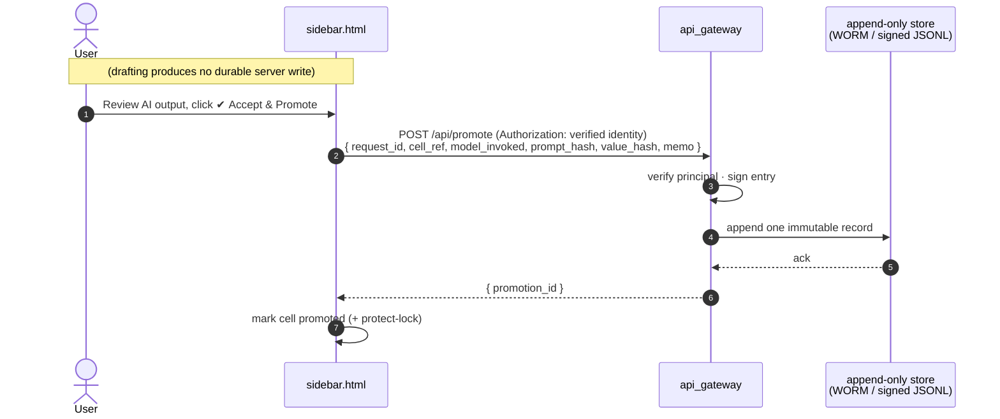

# 10 · Promotion & Provenance — Sketchbook vs. System-of-Record

**Status: design note (not yet implemented).** Records *why* and *how* durable
provenance attaches to AI output — and why it must **not** attach to every draft.

> Terminology: **ingress** = *inbound* (calls into our system); **egress** =
> *outbound* (calls out to external services).

---

## 1. Product framing (the premise)

This system is a **front-office drafting sandbox** — a shared sketch/model
scratchpad that can call AI — *not* a system of record. Front-office Excel users
adopt tools that stay **in the grid and fast**, and route around anything that
taxes every action with governance. So the design rule is:

> **Traceability is a *mode*, not a *tax*.**
> Free and uncontrolled while drafting → full provenance the moment an output is
> *promoted* (declared material by a human).

This matches how front-office regulation (EUC / End-User-Computing controls,
model-risk frameworks) actually works: control at the **point of materiality**,
not over throwaway scratch.

## 2. Why not log every draft

Durably storing every AI draft server-side is a **liability**, not diligence:

- permanently retains half-baked, speculative figures never meant to be
  authoritative;
- draft context often carries PII/confidential cells → triggers data-residency /
  DPA / retention obligations ([07-security-auditability.md](07-security-auditability.md) §6–7);
- building tamper-evident audit infra for scratch is effort where there's no
  decision to defend.

For unlocked drafts, the **local sheet record** (`__Prompt_records_v2` + cell
notes, written client-side) is proportionate. See
[07-security-auditability.md](07-security-auditability.md) §4 (qualified there).

## 3. The lock mechanic — current vs. target

The existing sidebar lock (advanced-options tickbox → cell note
`STATUS: LOCKED`) **cannot** serve as the promotion trigger as wired, because it
conflates two concepts and fires automatically:

| Concept | Today | Target |
|---|---|---|
| **Protect from AI overwrite** ("skip in bulk runs") | ✅ what the lock does | keep unchanged — auto-lock after a run is fine |
| **Promote as material** (→ append-only provenance) | ❌ conflated; auto-fires on *every* successful AI run; reversible; emits no server event | a **separate, explicit, human-initiated** action |

**Why the current lock fails the trigger:**

1. It is applied *by the machine* the instant an AI run succeeds — not a
   deliberate human review act.
2. Because every successful run auto-locks, hooking a log to `LOCKED` would
   durably record **every draft** — re-creating the liability in §2.
3. It is a reversible client-side note field (`LOCKED ⇄ READY`), not a
   directional server event.

## 4. The proposed "Promote" action

Add a distinct, deliberate act — separate from the protect-lock tickbox:

- **UI:** a `✔ Accept & Promote` button in the sidebar, pressed by the user
  *after reviewing* the AI output (not the advanced-options checkbox).
- **Semantics:** promotion is **directional** — a later un-promote is a *new*
  logged event, never a silent toggle-back.
- **Emits exactly one** append-only server record — per promotion, **not** per
  AI run.

### Append-only record shape (one entry per promotion)

```
promotion_id        · uuid
request_id          · ties back to the original AI run (correlation key)
authenticated_user  · verified principal (NOT the unsigned meta.user claim)
sheet + cell_ref    · what was promoted
model_invoked       · <provider>:<model> that produced the value
prompt_hash         · integrity ref to the prompt (not necessarily full text)
value_hash          · integrity ref to the promoted cell value
memo                · optional business justification (existing Audit Memo field)
reviewed            · true
ts                  · promotion timestamp
```

### Where it is written

A single ingress (inbound) endpoint, e.g. `POST /api/promote` at the gateway,
appending to a **durable append-only store** (HMAC-signed JSONL → object store
with Object-Lock / WORM in prod). The gateway — not the sheet — is the
server-of-record for promotions; `__Prompt_records_v2` remains the
human-readable mirror.



## 5. Hard dependency — authenticated principal

A promotion record keyed on the current **unsigned `meta.user` claim** is
provenance theater — anyone can forge it. Promotion therefore **depends on
ingress authentication** (Google-signed OIDC token minted by Apps Script,
verified at the gateway) — the top gap in
[07-security-auditability.md](07-security-auditability.md) §1. Ship promotion
*with* that auth, not before it.

## 6. Net design

| Activity | Server write | Rationale |
|---|---|---|
| Drafting (unlocked cells) | none durable | sketchbook; local sheet record suffices |
| Every LLM call | thin gateway **egress log** (request_id, user, model, latency, cost, guardrail/PII hits) — short retention, no full draft content | cost attribution + data-leaving-to-LLM monitoring; independent of drafts |
| **Promote** (human accepts a material output) | **one append-only, signed record** | the only durable provenance; scoped to material outputs; gated on authenticated user |

The **lock stays** for its real job (protect from AI overwrite). **Promotion** is
the new, explicit governance primitive — the single thing that earns a durable
record. This keeps the tool light for the 95% of throwaway drafting and
defensible exactly where the institution requires it.

## 7. Open decisions

- Full prompt text vs. hash only in the promotion record (retention vs.
  reconstructability trade-off).
- Retention period + deletion schedule for promotions.
- Whether un-promote requires a reason (recommended for finance).
